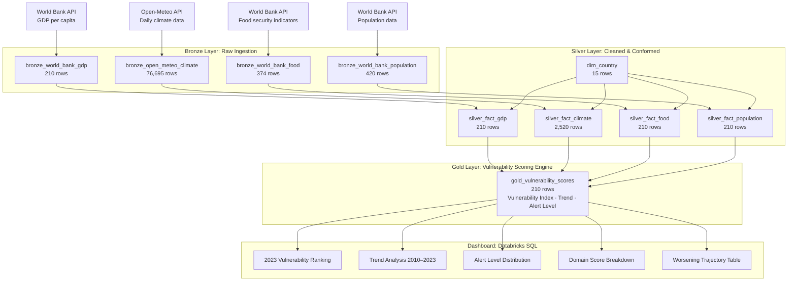
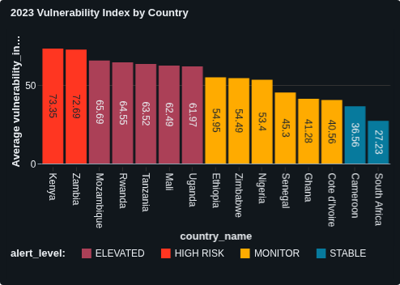
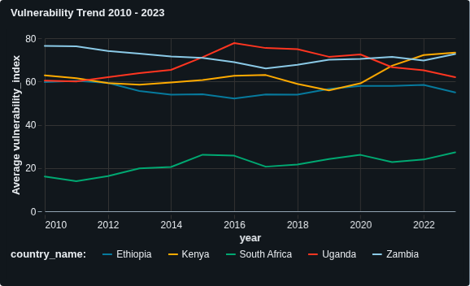
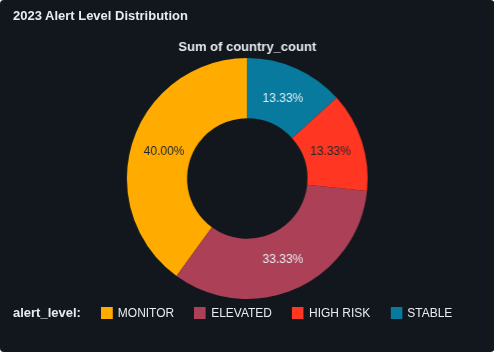
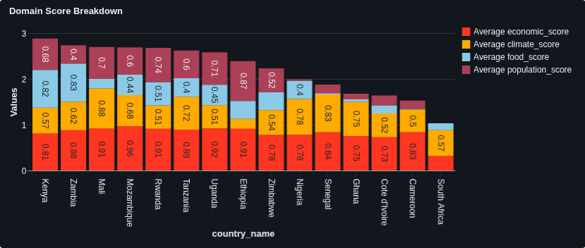
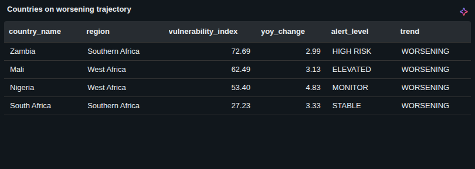

# EconMate
### Real-Time Economic & Climate Vulnerability Intelligence for Sub-Saharan Africa

> *A production-grade data engineering pipeline built entirely on Databricks: PySpark · Delta Lake · Unity Catalog · Medallion Architecture*

---

## The Story Behind This Project

I grew up in Nairobi. Not in the abstract, policy-document version of Nairobi, but in the real one where you notice things. You notice when the prices of commodities rise. You notice when your neighbour's son stops going to school in February. You notice the silence that falls over a market when the rains don't come for the third season in a row.

What I did not notice until much later was that these things were connected. The drought. The price spike. The school dropout. The quiet. They were not separate events happening to separate people. They were one compounding crisis, moving through a community like a slow current visible everywhere, named nowhere.

When I started learning data engineering, I kept running into the same wall. The tutorials were built around problems that already had infrastructure. New York taxi rides. Spotify listening history. Amazon reviews. The data was clean, the APIs were stable, the problems were solved.

Africa was always a footnote. Not because the data did not exist, but because nobody had built the pipeline to read it all in the same place at the same time.

I disagreed with that. So I built EconMate.

---

## The Problem

Sub-Saharan Africa is home to over 1.1 billion people and some of the world's most complex, compounding vulnerability cycles. A climate shock triggers a food crisis. A food crisis amplifies economic stress. Economic stress raises the conditions for conflict. Conflict worsens the next climate response.

The signals that describe this cycle exist. They are being collected by the World Bank, by climate scientists publishing open APIs, by humanitarian organisations tracking food insecurity.

But they are collected in silos.

A policymaker trying to understand which communities in East Africa face the highest compounding risk right now must pull a World Bank spreadsheet, cross-reference a climate bulletin, check food security publications, and manually reconcile four different country code standards before they have even started thinking about what the data means.

**The problem was never the data. The problem was the pipeline.**

---

## The Solution

EconMate ingests four live data sources, unifies them through a production-grade medallion architecture, and produces a single **Vulnerability Index**: a score from 0 to 100 per country per year that answers one question:

> *Which countries are facing the most dangerous combination of economic stress, climate shock, and food insecurity simultaneously, and are things getting better or worse?*

---

## Architecture



---

## The Four Data Sources

| Source | Domain | What It Provides | Countries | Years |
|---|---|---|---|---|
| World Bank API | Economic | GDP per capita (NY.GDP.PCAP.CD) | 15 | 2010–2023 |
| Open-Meteo API | Climate | Daily precipitation & temperature | 15 | 2010–2023 |
| World Bank API | Food Security | Undernourishment, stunting, underweight | 15 | 2010–2023 |
| World Bank API | Population | Total population & urban percentage | 15 | 2010–2023 |

### The 15 Target Countries

| ISO2 | Country | Region |
|---|---|---|
| KE | Kenya | East Africa |
| UG | Uganda | East Africa |
| TZ | Tanzania | East Africa |
| ET | Ethiopia | East Africa |
| RW | Rwanda | East Africa |
| GH | Ghana | West Africa |
| NG | Nigeria | West Africa |
| SN | Senegal | West Africa |
| ML | Mali | West Africa |
| CI | Cote d'Ivoire | West Africa |
| CM | Cameroon | Central Africa |
| ZA | South Africa | Southern Africa |
| MZ | Mozambique | Southern Africa |
| ZM | Zambia | Southern Africa |
| ZW | Zimbabwe | Southern Africa |

---

## Pipeline Layers

### Bronze: Raw Ingestion

Bronze is a faithful, append-only mirror of every source. No transformation. No rounding. No cleaning. Every row carries `ingested_at` and `source` metadata columns so you always know when data arrived and where it came from.

If a transformation bug is discovered six months from now, the fix is to reprocess from Bronze, not to re-call the APIs. Bronze makes that possible.

| Table | Rows | Write Mode | Key Concept |
|---|---|---|---|
| bronze_world_bank_gdp | 210 | append | Explicit schema, metadata columns |
| bronze_open_meteo_climate | 76,695 | overwrite | Rate limiting, exponential backoff |
| bronze_world_bank_food | 374 | overwrite | Long format, API substitution |
| bronze_world_bank_population | 420 | overwrite | Population as denominator |

### Silver: Cleaned & Conformed

Silver applies four transformations: rounding raw decimal values, joining all fact tables against `dim_country` to validate and standardise country codes, pivoting food and population from long to wide format, and aggregating 76,695 daily climate records into 2,520 monthly averages. Every Silver fact table uses `MERGE INTO`: meaning re-running the pipeline updates existing rows rather than duplicating them.

| Table | Rows | Write Mode | Key Concept |
|---|---|---|---|
| dim_country | 15 | overwrite | Country dimension, nullable=False |
| silver_fact_gdp | 210 | MERGE INTO | MERGE upsert, inner join filter |
| silver_fact_climate | 2,520 | MERGE INTO | Monthly aggregation, groupBy().agg() |
| silver_fact_food | 210 | MERGE INTO | pivot() long-to-wide |
| silver_fact_population | 210 | MERGE INTO | LongType cast, pivot() |

### Gold: Vulnerability Scoring Engine

Gold joins all four Silver fact tables on `country_code` and `year`, normalises every indicator to a 0–1 scale using min-max normalisation, calculates a weighted composite Vulnerability Index, detects year-over-year trend direction using `lag()` window functions, and applies alert flags. The output is one row per country per year with a score, a trend label, and an alert level.

**Domain weights:**

| Domain | Weight | Reasoning |
|---|---|---|
| Food Security | 35% | Most direct signal of human crisis |
| Economic | 25% | Leading indicator preceding food crises |
| Climate | 25% | Environmental shock trigger |
| Population Pressure | 15% | Exposure modulator |

**2023 Vulnerability Rankings:**

| Country | Score | Alert Level | Trend |
|---|---|---|---|
| Kenya | 73.35 | HIGH RISK | STABLE |
| Zambia | 72.69 | HIGH RISK | WORSENING |
| Mozambique | 65.69 | ELEVATED | STABLE |
| Rwanda | 64.55 | ELEVATED | STABLE |
| Tanzania | 63.52 | ELEVATED | STABLE |
| Mali | 62.49 | ELEVATED | WORSENING |
| Uganda | 61.97 | ELEVATED | IMPROVING |
| Ethiopia | 54.95 | MONITOR | IMPROVING |
| Zimbabwe | 54.49 | MONITOR | STABLE |
| Nigeria | 53.40 | MONITOR | WORSENING |
| Senegal | 45.30 | MONITOR | STABLE |
| Ghana | 41.28 | MONITOR | STABLE |
| Cote d'Ivoire | 40.56 | MONITOR | STABLE |
| Cameroon | 36.56 | STABLE | IMPROVING |
| South Africa | 27.23 | STABLE | WORSENING |

---

## Dashboard

Built on Databricks SQL: live vulnerability intelligence across 15 Sub-Saharan African countries, 2010–2023.

### Vulnerability Index by Country (2023)


### Vulnerability Trend 2010–2023


### Alert Level Distribution


### Domain Score Breakdown


### Countries on Worsening Trajectory


---

## Engineering Decisions

### Decision 1: Unity Catalog over DBFS
Early Bronze notebooks used DBFS paths (`/mnt/econmate/bronze/...`). Midway through development, DBFS was found to be disabled on the workspace, a policy common in enterprise Databricks environments. Rather than treating this as a blocker, the pipeline was migrated entirely to Unity Catalog managed tables using `saveAsTable()` and `spark.table()`. This is the modern, correct approach: Unity Catalog provides governance, access controls, data lineage, and audit logs that DBFS cannot. The migration was actually an upgrade.

### Decision 2: MERGE INTO over append for Silver
Bronze uses append because raw history must be preserved. Silver uses `MERGE INTO` because Silver tables represent current truth, not accumulating history. If the World Bank revises a historical GDP figure, the next pipeline run must correct it, not duplicate it. `MERGE INTO` compares incoming data against the existing table on a natural key (`country_code + year`) and updates matching rows while inserting new ones. Re-running Silver 100 times always produces exactly the same row count. This is idempotency.

### Decision 3: Replacing FEWS NET with World Bank food indicators
FEWS NET was the original food security source. During development, their API returned consistent HTTP 500 errors, a server-side failure outside our control. Rather than blocking the project on an uncontrollable dependency, three World Bank food security indicators were substituted: undernourishment prevalence, child stunting, and child underweight. The World Bank API was already proven reliable, the substitution reused the existing fetch pattern, and the conceptual signal was equivalent. Never let a third-party outage stop a pipeline.

### Decision 4: Exponential backoff for rate limiting
Open-Meteo's free tier rate-limits requests after 9 consecutive country fetches. Rather than re-running the full 15-country loop (which would have duplicated the 9 successful records), only the 6 failed countries were isolated, and a retry function with exponential backoff was applied, waiting 10 seconds, then 20, then 40 between retries. A 5-second deliberate pause was added between all subsequent calls. This is the standard production pattern for rate-limited APIs and is worth knowing for any pipeline that touches external data.

### Decision 5: Left join in Gold, inner join in Silver
Silver uses inner joins against `dim_country` as an implicit data quality filter; any Bronze row with an unrecognised country code is dropped rather than propagating downstream with a null region. Gold uses left joins across all four Silver tables, if any source has a gap for a particular country-year, that row keeps its other domain values rather than being dropped entirely. The join strategy reflects the purpose: Silver filters for quality, Gold preserves coverage.

### Decision 6: Min-max normalisation with directional flipping
Four domains, four different units, GDP in USD, precipitation in mm, temperature in °C, and undernourishment as a percentage. These cannot be weighted and summed directly without normalisation. Min-max scales every indicator to 0–1 across all 210 country-year combinations. Critically, direction matters: low GDP means more vulnerable, so the normalised GDP score is flipped (`1 - normalised`). High temperature means more vulnerable, so temperature is normalised directly. Getting directionality wrong would produce a scoring engine that rewards poverty, the most important design decision in the entire Gold layer.

### Decision 7: Food security weighted highest at 35%
When people cannot eat, crisis has already arrived; no other signal is needed. GDP decline, drought, and population pressure are leading indicators that precede food crises. Food insecurity is the crisis itself. The 35% weight reflects that hierarchy.
---

## What Surprised Me

**1. The data is better than I expected, and worse.**
World Bank GDP data was complete for all 15 countries across all 14 years, with zero nulls. But food security data had 128 missing values for stunting and underweight across the same countries. The World Bank collects GDP figures reliably because governments report them. Stunting requires field surveys that many governments deprioritise or cannot fund. The data gaps are not random; they reflect which kinds of knowledge the world invests in collecting.

**2. Mali's climate score explains more than its food score.**
I expected Ethiopia or Zambia to score highest on the food domain. Zambia did. But Mali, with only 12.3% undernourishment, still scored ELEVATED overall because its climate score was the highest of any country in the dataset. Mali is partly in the Saharan desert. The pipeline captured that. The scoring engine penalised drought exposure correctly even when the food numbers looked moderate. Climate is not just a trigger; it is a structural condition.

**3. Idempotency is not optional.**
I re-ran notebook cells more times than I can count during development. Without MERGE INTO in Silver, the tables would have accumulated thousands of duplicate rows. The first time I saw 840 rows in a table that should have had 420, I understood viscerally why idempotency matters, not as a concept, but as a survival mechanism for iterative development.

**4. The environment is part of the engineering.**
Discovering that DBFS was disabled midway through the project felt like a setback. It was not. It forced a migration to Unity Catalog that I would have needed to do eventually anyway, and it taught me that the storage layer is an architectural decision, not a given. 
**5. The story in the data is real.**
Kenya at 73.35 HIGH RISK is not a number produced by an algorithm. It is a reflection of 36.8% undernourishment, a persistently low GDP, and a rural population with high climate exposure. Zambia's worsening is not a flag; it is a trend that real people are living through right now. Building this pipeline made the abstraction of "data engineering" feel like something closer to responsibility.

---

## Tech Stack

```
Compute          Databricks (Serverless)
Processing       Apache PySpark 3.5+
Table Format     Delta Lake
Governance       Unity Catalog
Orchestration    Databricks Workflows (Milestone 4)
Version Control  GitHub
Visualisation    Databricks SQL Dashboard
Language         Python 3.11+
```

---

## Project Structure

```
econmate/
├── README.md
├── screenshots/
│   ├── VulnerabilityIndexbyCountry.png
│   ├── VulnerabilityTrend.png
│   ├── AlertLevelDistribution.png
│   ├── DomainScoreBreakdown.png
│   └── countriesonworseningtrajectory.png
├── bronze/
│   ├── 01_ingest_world_bank
│   ├── 02_ingest_open_meteo
│   ├── 03_ingest_world_bank_food
│   └── 04_ingest_world_bank_population
├── silver/
│   ├── 01_dim_country
│   ├── 02_silver_gdp
│   ├── 03_silver_climate
│   ├── 04_silver_food
│   └── 05_silver_population
└── gold/
    └── 01_vulnerability_scoring
```

---

## Milestones

| Milestone | Description | Status |
|---|---|---|
| M1 — Bronze Ingestion | Four live APIs ingested into Delta Bronze tables | Complete |
| M2 — Silver Transforms | MERGE upserts, pivot, monthly aggregation, dim_country | Complete |
| M3 — Gold Scoring Engine | Vulnerability index, trend detection, alert flags | Complete |
| M4 — Dashboard | Five Databricks SQL visualisations | Complete |

---

## Author

**Duncan Otieno** · Data Engineer · Nairobi, Kenya

[linkedin.com/in/duncan-otieno](https://linkedin.com/in/duncan-otieno) · [github.com/Duncan610](https://github.com/Duncan610)

---

*EconMate is open source. The data it uses is publicly available. The problem it addresses is urgent.*
